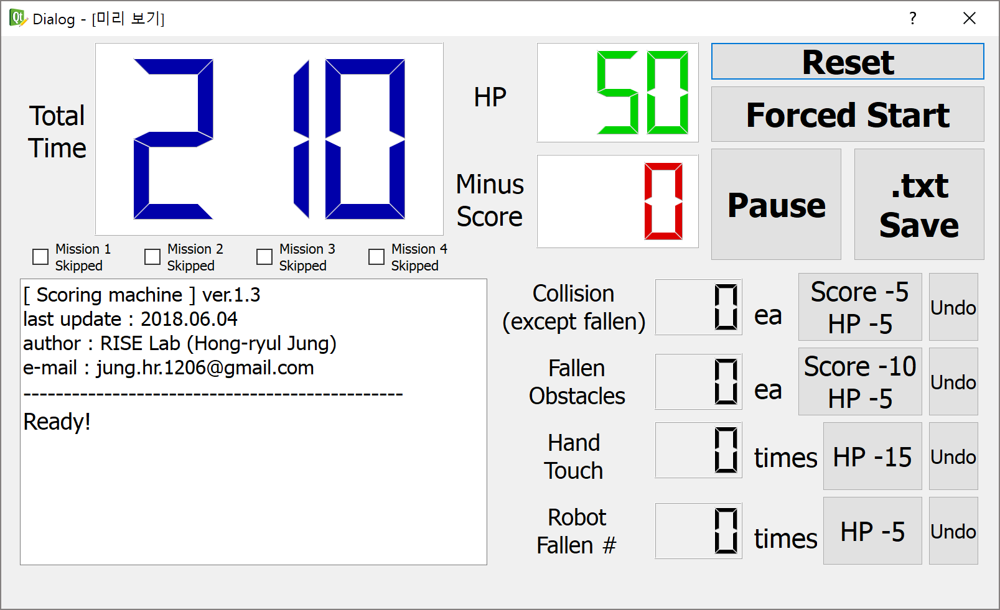

# Competition-Scoring-Program
로봇대회 자동채점 프로그램 (성대 기계공학부 진동실습)

- 본 프로그램은 공정한 과제평가를 위해 고안되었습니다.
- 본 프로그램은 PyQt4를 사용하여 gui를 만들었기 때문에 GNU GPLv3를 따릅니다.
- 본 설명서는 관련 내용을 처음 접하는 사람의 수준에서 기술되었습니다.

<!--  -->


## 1. 요구 사항
### 하드웨어
필요한 부품은 반드시 마스터조교가 취합하여 구매할 것
- 라즈베리파이(키보드, 마우스, 모니터를 연결하여 사용)
- IR 수신/송신모듈 세트(or 스위치)

### 소프트웨어
라즈베리파이에 아래 내용을 입력하여 설치할 것(명령어 입력은 터미널에서 하면 되고, 터미널은 ```Ctrl```+```Alt```+```T```를 눌러 켤 것)
- Git
- Python 2.7
- PyQt4 (GNU GPLv3)
```
sudo apt-get install git python2.7 python-qt4
```

## 2. 설치
설치 후 정상작동하며 채점에 이상이 없는지 __반드시 사전에 확인할 것__
1. 현재 __1920x1080__ 해상도에 맞춰져 있다. 실행화면이 해상도에 따라 화면 밖으로 잘릴 수도 있으므로 라즈베리파이 및 모니터의 해상도를 미리 확인하고 적절하게 변경할 것 (라즈베리파이 화면해상도 변경방법은 구글검색하면 찾을 수 있음)
1. 라즈베리파이에서 ```Ctrl```+```Alt```+```T```를 눌러 터미널에 접속한 후 아래 내용을 입력하여 본 프로그램을 다운 받는다.
    ```
    git clone https://github.com/ryul1206/Competition-Scoring-Program.git
    ```
1. 아래 내용을 입력하여 ```.bashrc```를 연다.
    ```
    gedit ~/.bashrc
    ```
1. ```.bashrc``` 마지막 줄에 아래 두 줄을 추가하고 저장한다.
    ```
    alias skku='cd ~/Competition-Scoring-Program; python main.py'
    skku
    ```
    이제 ```Ctrl```+```Alt```+```T```를 눌러 터미널창을 다시 열면 자동으로 프로그램이 실행될 것이다.
    만약 자동으로 실행되는 것이 불편하면 ```.bashrc``` 마지막에 추가한 ```skku``` 부분만 삭제한다. 터미널에서 ```skku```를 입력하면 프로그램이 실행될 것이다.(```alias```는 일종의 단축키 설정임)
1. 경기장에 센서가 흔들리지 않도록 부착한 후 올바른 GPIO핀과 연결한다. 라즈베리파이 GPIO의 번호별 위치는 아래 내용를 입력하여 확인할 수 있다.('라즈베리파이 GPIO'라고 검색해도 된다.)
    ```
    gpio readall
    ```

## 3. 실행
위 "설치" 과정을 따랐다면 터미널에서 ```skku```를 입력하면 실행될 것이다. 위 설치과정을 따르지 않았더라도 프로그램이 있는 경로에서 ```python main.py```를 터미널에 입력하면 실행할 수 있다.

## 4. 편집
### gui
PC에서 Qt Designer4로 ```.ui```확장자를 가진 파일을 수정할 수 있으며, 수정완료 후 아래 내용을 터미널에서 입력하여 파이썬코드를 생성할 수 있다. 만약 패키지가 없어 오류가 난다면 해당 패키지를 설치 할 것
```
pyuic4 –x file_name.ui –o file_name.py
```

### code
- 채점 규칙이나 배점이 바뀌면 반영한다.
- 통과측정 센서의 개수가 변할 때도 이를 반영한다.(중요)
